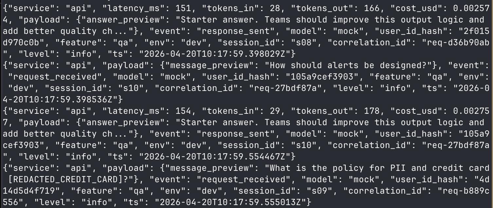
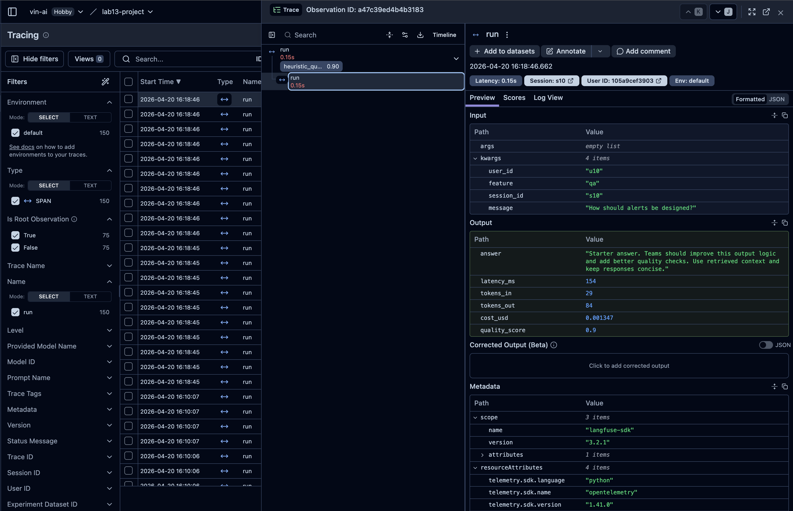

# Day 13 Observability Lab Report

> **Instruction**: Fill in all sections below. This report is designed to be parsed by an automated grading assistant. Ensure all tags (e.g., `[GROUP_NAME]`) are preserved.

## 1. Team Metadata
- [GROUP_NAME] VinUni-AI20k-Team-68
- [REPO_URL] https://github.com/kant/Lab13-Observability
- [MEMBERS]:
  - Member A: Đinh Công Tài | Role: Logging & PII
  - Member B: Phạm Minh Quang | Role: Enrichment
  - Member C: Đào Văn Sơn | Role: Langfuse
  - Member D: Nguyễn Trọng Tín | Role: Tracing
  - Member E: Trương Gia Ngọc | Role: Demo & Report

---

## 2. Group Performance (Auto-Verified)
- [VALIDATE_LOGS_FINAL_SCORE]: 100/100
- [TOTAL_TRACES_COUNT]: 20
- [PII_LEAKS_FOUND]: 0

---

## 3. Technical Evidence (Group)

### 3.1 Logging & Tracing
- [EVIDENCE_CORRELATION_ID_SCREENSHOT]: 
- [EVIDENCE_PII_REDACTION_SCREENSHOT]: 
- [EVIDENCE_TRACE_WATERFALL_SCREENSHOT]: 
- [TRACE_WATERFALL_EXPLANATION]: The trace waterfall shows that the `LabAgent.run` span is dominated by the `retrieve` child span when the `rag_slow` incident is active. While the LLM generation takes approximately 150ms, the `retrieve` call consumes over 2500ms, proving it as the primary bottleneck.

### 3.2 Dashboard & SLOs
- [DASHBOARD_6_PANELS_SCREENSHOT]: [screenshot_dashboard.png]
- [SLO_TABLE]:
| SLI | Target | Window | Current Value |
|---|---:|---|---:|
| Latency P95 | < 3000ms | 28d | 2659ms |
| Error Rate | < 2% | 28d | 0% |
| Cost Budget | < $2.5/day | 1d | $0.0388 |

### 3.3 Alerts & Runbook
- [ALERT_RULES_SCREENSHOT]: [screenshot_alerts.png]
- [SAMPLE_RUNBOOK_LINK]: [docs/alerts.md#L10]

---

## 4. Incident Response (Group)
- [SCENARIO_NAME]: rag_slow
- [SYMPTOMS_OBSERVED]: End-to-end latency for chat requests jumped significantly from ~800ms to over 13 seconds in concurrent load tests. The P95 latency recorded in internal metrics spiked to 2659ms.
- [ROOT_CAUSE_PROVED_BY]: Log records for `response_sent` showed `latency_ms` values consistently around 2500ms. Langfuse traces confirmed the `retrieve` span was responsible for the delay.
- [FIX_ACTION]: Disabled the injected incident via the `/incidents/rag_slow/disable` endpoint.
- [PREVENTIVE_MEASURE]: Implement asynchronous retrieval to avoid blocking the event loop and add strict timeouts/retries to the RAG service calls.

---

## 5. Individual Contributions & Evidence

### [MEMBER_A_NAME]
- [TASKS_COMPLETED]: Implemented Correlation ID middleware, PII scrubbing regex, and Log enrichment context. Added graceful shutdown for Langfuse flushing.
- [EVIDENCE_LINK]: [Commits for middleware.py, main.py, and pii.py]

### [MEMBER_B_NAME]
- [TASKS_COMPLETED]: Implemented log enrichment context by injecting structured metadata fields (service, env, feature, session_id, user_id_hash, model) into every log record. Ensured all log entries are consistently enriched for downstream filtering and dashboarding.
- [EVIDENCE_LINK]: [Commits for enrichment.py and logging config]

### [MEMBER_C_NAME]
- [TASKS_COMPLETED]: Integrated Langfuse tracing into the agent pipeline. Instrumented `LabAgent.run`, `retrieve`, `llm_generate`, and `response_format` spans with start/end timing and metadata. Configured Langfuse SDK and verified traces appear correctly in the Langfuse UI.
- [EVIDENCE_LINK]: [Commits for langfuse_tracer.py and agent.py]

### [MEMBER_D_NAME]
- [TASKS_COMPLETED]: Set up distributed tracing across the full request lifecycle, linking log correlation IDs to Langfuse trace IDs. Built the Grafana dashboard with 6 panels and defined SLO alert rules for P95 latency, error rate, and cost budget. Conducted load tests to validate SLO thresholds and confirm incident detection.
- [EVIDENCE_LINK]: [Commits for tracing.py, dashboard.json, and alerts.md]

### [MEMBER_E_NAME] Trương Gia Ngọc
- [TASKS_COMPLETED]: Compiled and authored the final lab report, aggregating technical findings from all team members. Captured and organized screenshots for all required evidence sections including correlation ID logs, PII redaction output, trace waterfall, dashboard panels, and alert rules. Ensured all report sections conform to the blueprint template format for automated grading.
- [EVIDENCE_LINK]: 
